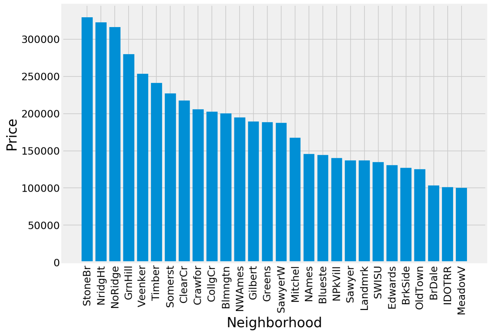
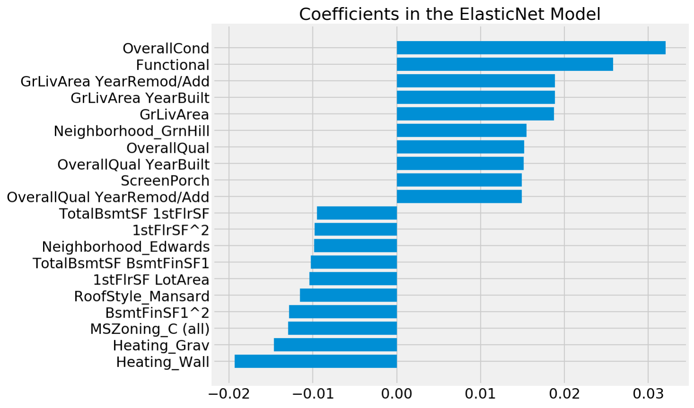
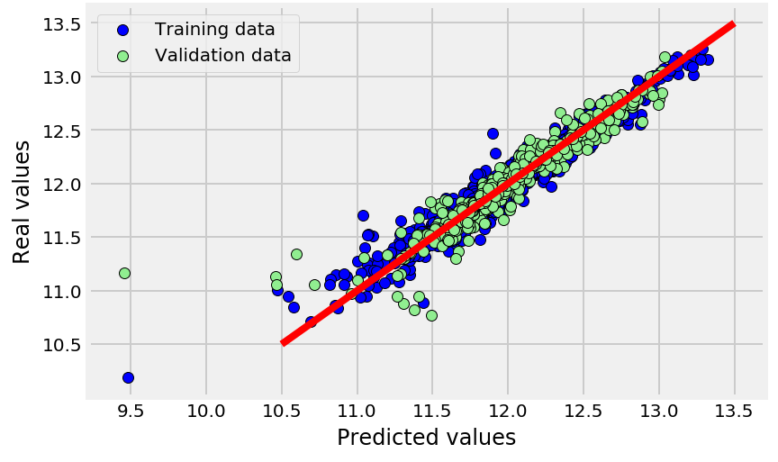

#  Project 2: Analysis and Modeling of Ames Housing Data

### Overview

In Project 2, we are going to analyze the housing prices in Ames, Iowa. The data files are derived from the following sources:

* [train](https://www.kaggle.com/c/dsi-us-6-project-2-regression-challenge/download/train.csv)
* [test](https://www.kaggle.com/c/dsi-us-6-project-2-regression-challenge/download/test.csv)

In train set, the house prices are given and we are supposed to build a machine learning model to predict the price tags for the houses given in the test set based on their features. The Ames Housing Dataset was introduced by Prof. Dean DeCock in 2011 as an alternative to the Boston Housing Dataset. It contains 2,930 observations of housing sales in Ames, Iowa between 2006 and 2010. There are 23 nominal, 23 ordinal, 14 discrete, and 20 continuous features describing each house’s size, quality, area, age, and other miscellaneous attributes.

The following data dictionary describes different features given in the data set along with their type and description.

|Feature|Type|Description|
|---|---|---|
|Id| *Discrete* |Observation number|
|PID| *Nominal* |Parcel identification number  - can be used with city web site for parcel review|
|MSSubClass| *Nominal* |Identifies the type of dwelling involved in the sale|
|MSZoning| *Nominal* |Identifies the general zoning classification of the sale|
|LotFrontage| *Continuous* |Linear feet of street connected to property|
|LotArea| *Continuous* |Lot size in square feet|
|Street| *Nominal* |Type of road access to property|
|Alley| *Nominal* |Type of alley access to property|
|LotShape| *Ordinal* |General shape of property|
|LandContour| *Nominal* |Flatness of the property|
|Utilities| *Ordinal* |Type of utilities available|
|LotConfig| *Nominal* |Lot configuration|
|LandSlope| *Ordinal* |Slope of property|
|Neighborhood| *Nominal* |Physical locations within Ames city limits (map available)|
|Condition1| *Nominal* |Proximity to various conditions|
|Condition2| *Nominal* |Proximity to various conditions (if more than one is present)|
|BldgType| *Nominal* |Type of dwelling|
|HouseStyle| *Nominal* |Style of dwelling|
|OverallQual| *Ordinal* |Rates the overall material and finish of the house|
|OverallCond| *Ordinal* |Rates the overall condition of the house|
|YearBuilt| *Discrete* |Original construction date|
|YearRemod/Add| *Discrete* |Remodel date (same as construction date if no remodeling or additions)|
|RoofStyle| *Nominal* |Type of roof|
|RoofMatl| *Nominal* |Roof material|
|Exterior1| *Nominal* |Exterior covering on house|
|Exterior2| *Nominal* |Exterior covering on house (if more than one material)|
|MasVnrType| *Nominal* |Masonry veneer type|
|MasVnrArea| *Continuous* |Masonry veneer area in square feet|
|ExterQual| *Ordinal* |Evaluates the quality of the material on the exterior|
|ExterCond| *Ordinal* |Evaluates the present condition of the material on the exterior|
|Foundation| *Nominal* |Type of foundation|
|BsmtQual| *Ordinal* |Evaluates the height of the basement|
|BsmtCond| *Ordinal* |Evaluates the general condition of the basement|
|BsmtExposure| *Ordinal* |Refers to walkout or garden level walls|
|BsmtFinType1| *Ordinal* |Rating of basement finished area|
|BsmtFinSF1| *Continuous* |Type 1 finished square feet|
|BsmtFinType2| *Ordinal* |Rating of basement finished area (if multiple types)|
|BsmtFinSF2| *Continuous* |Type 2 finished square feet|
|BsmtUnfSF| *Continuous* |Unfinished square feet of basement area|
|TotalBsmtSF| *Continuous* |Total square feet of basement area|
|Heating| *Nominal* |Type of heating|
|HeatingQC| *Ordinal* |Heating quality and condition|
|CentralAir| *Nominal* |Central air conditioning|
|Electrical| *Ordinal* |Electrical system|
|1stFlrSF| *Continuous* |First Floor square feet|
|2ndFlrSF| *Continuous* |Second floor square feet|
|LowQualFinSF| *Continuous* |Low quality finished square feet (all floors)|
|GrLivArea| *Continuous* |Above grade (ground) living area square feet|
|BsmtFullBath| *Discrete* |Basement full bathrooms|
|BsmtHalfBath| *Discrete* |Basement half bathrooms|
|FullBath| *Discrete* |Full bathrooms above grade|
|HalfBath| *Discrete* |Half baths above grade|
|Bedroom| *Discrete* |Bedrooms above grade (does NOT include basement bedrooms)|
|Kitchen| *Discrete* |Kitchens above grade|
|KitchenQual| *Ordinal* |Kitchen quality|
|TotRmsAbvGrd| *Discrete* |Total rooms above grade (does not include bathrooms)|
|Functional| *Ordinal* |Home functionality (Assume typical unless deductions are warranted)|
|Fireplaces| *Discrete* |Number of fireplaces|
|FireplaceQu| *Ordinal* |Fireplace quality|
|GarageType| *Nominal* |Garage location|
|GarageYrBlt| *Discrete* |Year garage was built|
|GarageFinish| *Ordinal* |Interior finish of the garage|
|GarageCars| *Discrete* |Size of garage in car capacity|
|GarageArea| *Continuous* |Size of garage in square feet|
|GarageQual| *Ordinal* |Garage quality|
|GarageCond| *Ordinal* |Garage condition|
|PavedDrive| *Ordinal* |Paved driveway|
|WoodDeckSF| *Continuous* |Wood deck area in square feet|
|OpenPorchSF| *Continuous* |Open porch area in square feet|
|EnclosedPorch| *Continuous* |Enclosed porch area in square feet|
|3-SsnPorch| *Continuous* |Three season porch area in square feet|
|ScreenPorch| *Continuous* |Screen porch area in square feet|
|PoolArea| *Continuous* |Pool area in square feet|
|PoolQC| *Ordinal* |Pool quality|
|Fence| *Ordinal* |Fence quality|
|MiscFeature| *Nominal* |Miscellaneous feature not covered in other categories|
|MiscVal| *Continuous* |$ Value of miscellaneous feature|
|MoSold| *Discrete* |Month Sold (MM)|
|YrSold| *Discrete* |Year Sold (YYYY)|
|SaleType| *Nominal* |Type of sale|
|SaleCondition| *Nominal* |Condition of sale|
|SalePrice| *Continuous* |Sale price|

### Data Cleaning

After importing the data sets, both were concatenated into a single data frame so the new features and modifications will be performed on both. Then the null items were filled with appropriate values. In almost all cases, the null items were related to the absence of that feature in the associated building. For example, the null values of the feature `PoolQC` reflect lack of pool in that property and so the corresponding entries were filled with `NA`. 

In next step, some numerical features, such as `MSSubClass` and `MoSold`, which inherently represent categories were encoded into categorical subclasses. Assigning a higher number to the month December compared to January mat imply a hierarchical system for the month while it is not actually the case and this will render some problems in the modeling. 

Finally, I encoded all ordinal categorical features as ordered numbers. For example, for the feature `BsmtCond` the encoded ordered numbers are:

|Basement Condition| Encoded Number|
|--- |---|
|NA |0|
|Poor| 1|
|Fair |2|
|Typical|3|
|Good|4|
|Excellent|5|

### Exploratory Data Analysis 

In order to find the correlation of features with the sale price, I plotted the correlation graph and selected top 10 mostly correlated features to study more in-depth. These features are:

|Top 10 correlated|
|---|
|`OverallQual`|
|`ExterQual`|
|`GrLivArea`|
|`KitchenQual`|
|`GarageArea`|
|`GarageCars`|
|`TotalBsmtSF`|
|`1stFlrSF`|
|`BsmtQual`|
|`YearBuilt`|

The scatter plots of these features versus the sale price show that, on average, as these features increase the price tag grows too. Therefore, they exhibit a monotonic behavior with the sale price. The other important feature highly affecting the price is the neighborhood. The following diagram displays the average property values at each neighborhood.

### Feature Engineering 

I first extracted a list of numerical features and from that I excluded the following features as they seem to have no impact on the sale price: `Id`, `PID`, and `YrSold`. Similarly, I prepared a list of categorical features and I excluded `MoSold` since I doubt the month of sale to be important in determining the value of a property. Then for the rest of categorical features I created dummy variables to represent their range of values in numerical format. Finally,  I extracted the list of 40 numerical features mostly correlated with the sale price (including dummy features) and for these columns I created polynomial features of degree 2, including both the interaction and quadratic terms. At the end, I had 1036 features to be chosen for the modeling.

### Modeling 

After creating required features, I split the train and test data sets and I solely concentrated on the train set for the sake of modeling. Before starting the modeling, I realized that the distribution of the sale price is far from normal and this may affect the quality and accuracy of the linear regression. So, I used the logarithmic transformation to make the distribution more normal and reduce the amount of skewness. Then the available data were divided into train and test chunks and both were scaled based on the mean and standard deviation of the train set. 

Checking the data dictionary, I realized that there are multiple collinear features in the data which could render the model less accurate. For example, the features `GarageArea` and `GarageCars` are closely related. So, to remedy this issue, I employed Elastic Net regularization technique. The grid search yielded that the optimal values of `l1_ratio` and `alpha` to be used in Elastic Net algorithm are 0.01 and 0.098, respectively. Using these values, I defined an efficient regularization scheme and after fitting the model, evaluated the coefficients of each feature. The results show that the Elastic Net algorithm picked 446 features and eliminated the other 590 features. Following, the top 10 positive and top 10 negative features are illustrated.

### Model Accuracy 

In order to assess the accuracy of the model, I estimated the R2 score for train, test, and cross validation data sets. The results are summarized in the following table:

|Data set|R2 Score|
|---|---|
|Train|0.9475|
|Test|0.8859|
|Cross Validation (cv=5)|0.9030|

These numbers indicate that the model is overfitting, probably due to high number of features. So, to improve the model we can decrease the variety of features and only concentrate on the impactful ones. But in general, the model is predicting the sale price relatively good. It is clearly evident from the following graph which illustrates real values versus predictions for both train and test data sets. It is clear that except few outliers, the majority of data points are well gathered close to the line of perfect accuracy.

### Analysis and Takeaways 

Elucidating the important coefficients of the model indicates that some factors tend to elevate the price tag of a property and some other factors have a negative impact on that. A thorough study of model outcomes shows that the following items cause a **price elevation**:

* Having better overall conditions
* Having enhanced functionality
* Having higher living area
* Being newly constructed/remodeled 
* Being located in an affluent neighborhood
* Having a larger screen porch

and the following factors tend to cause **price depreciation**:

* Unfavorable type of heating 
* Being located in a commercial zoning
* Unfavorable roof style
* having very large basements
* Being located in a poor neighborhood 

Since Ames is located in a cold and windy area, it is not surprising that the heating style heavily affects the quality and favorability of a property. This factor may not be as important in hot and humid climates, for example in Florida. Due to this weather condition, some luxury features (such as have a pool) does not add much to the overall value of a house. These outcomes are specific to the town of Ames and cannot be generalized to other areas.
